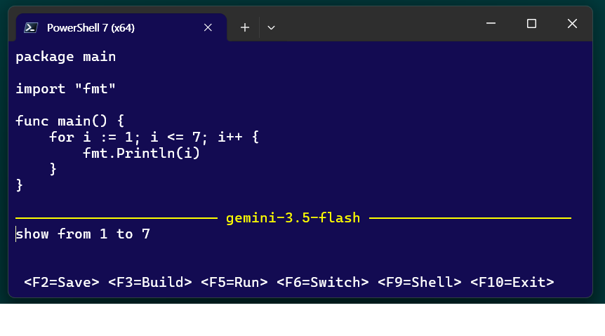
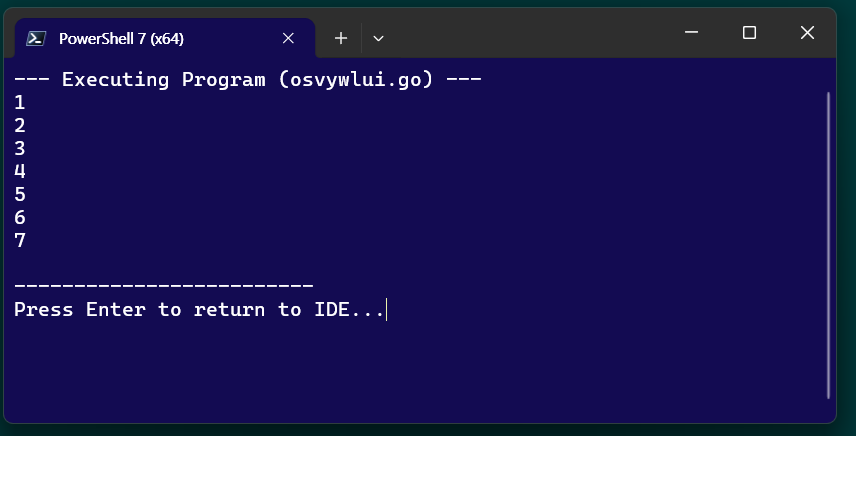
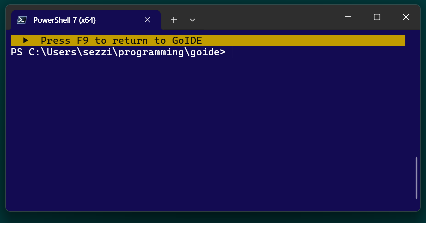

# GoIDE

GoIDE is a terminal-based, AI-powered IDE for the Go programming language. Built with `tview`, it provides a seamless command-line development experience with built-in AI code generation, direct code execution, and shell integration.

## Screenshots

### 1. Coding

Write and generate Go code using the built-in AI assistant and TUI text editor.

### 2. Executing

Quickly run or build your code directly from the interface.

### 3. Dropping into a shell

Temporarily drop into a PowerShell session and return right where you left off.

## Features

- **AI Code Assistant**: Integrate with multiple AI providers (Google, Groq, Ollama, Upstage) to generate and modify Go code through natural language instructions.
- **TUI Text Editor**: A lightweight, terminal-based editor with system clipboard support.
- **Quick Run & Build**: Instantly run your temporary Go code (F5) or build it into a `.exe` executable (F3).
- **Shell Mode**: Temporarily suspend the IDE and drop into a PowerShell session (F9), then return right back where you left off.
- **Customizable Colors**: Configure TUI themes directly in the source code.

## Keyboard Shortcuts

- `F2`: Save as `.go` file
- `F3`: Build to `.exe`
- `F5`: Run Code
- `F6`: Switch Focus (Editor <-> AI Prompt)
- `F9`: Shell Mode (PowerShell)
- `F10`: Exit
- `F12`: Select AI Model

## Installation

1. Clone the repository:
   ```bash
   git clone <repository_url>
   cd goide
   ```
2. Build the executable using the provided script:
   ```powershell
   .\build.ps1
   ```

## Configuration

GoIDE expects an `.apikeys.json` file in your `Documents` directory (`~/Documents/.apikeys.json`) to load API keys and custom model definitions for the supported AI providers.

```json
{
  "google": {
    "apiKey": "YOUR_API_KEY",
    "models": [
      { "name": "gemini-3.5-flash", "alias": "Gemini 3.5 flash" }
    ]
  },
  "ollama": {
    "apiKey": "",
    "models": [
      { "name": "llama3", "alias": "Llama 3 (Local)" }
    ]
  }
}
```
*(API keys are decrypted dynamically if encryption is implemented via the `goide/crypto` package)*
